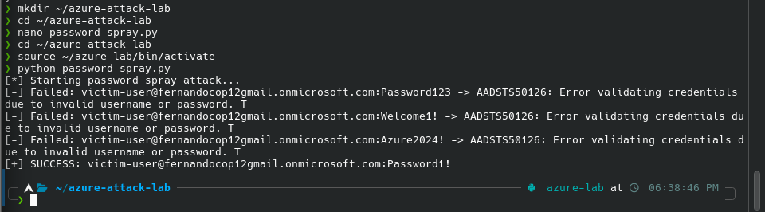
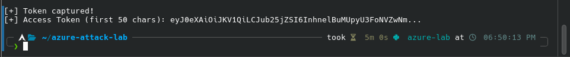
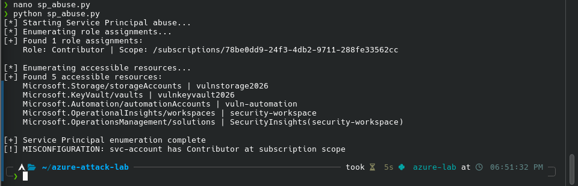
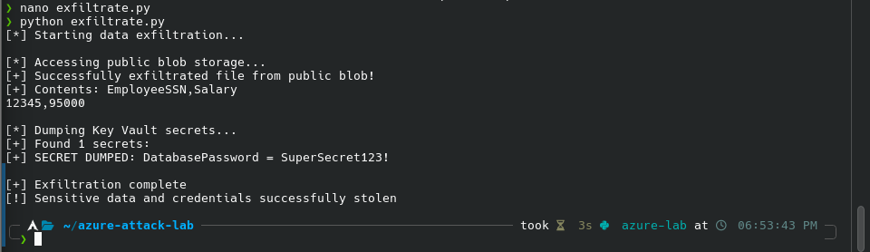
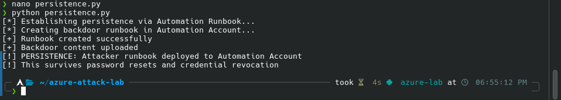
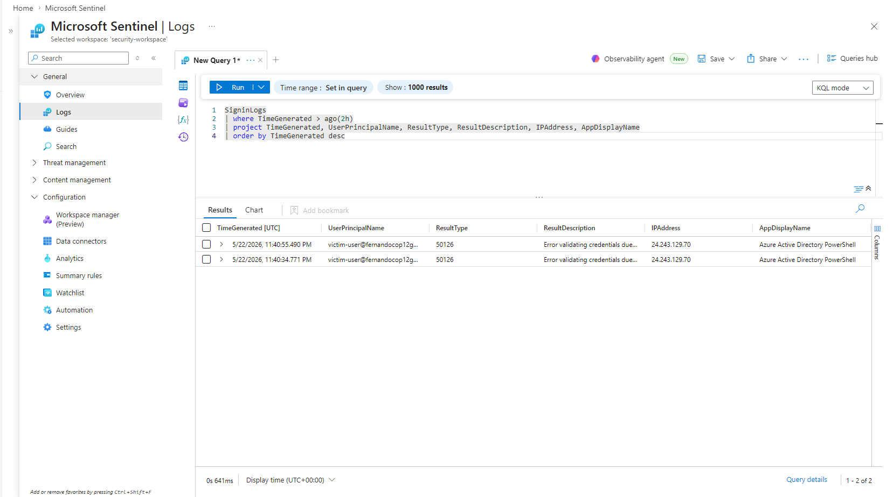
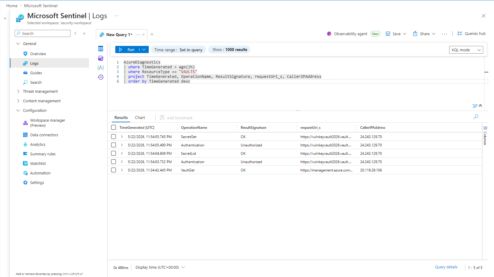
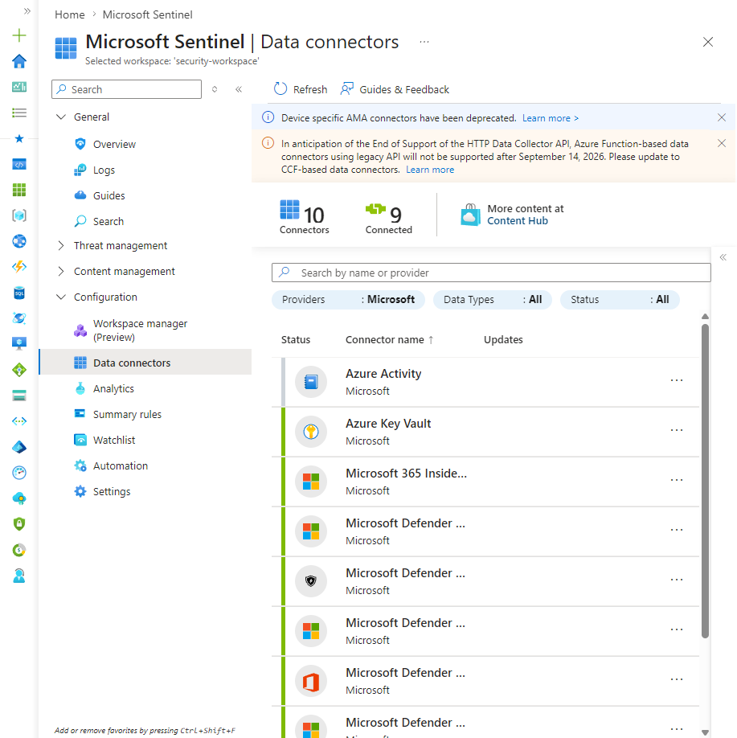
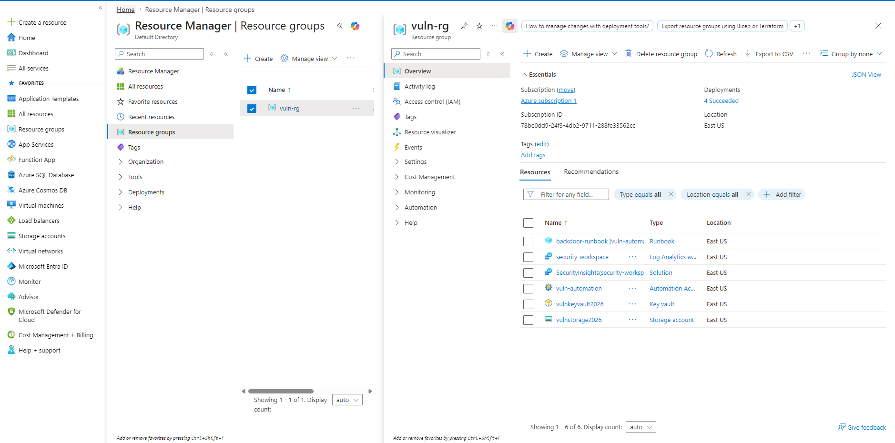
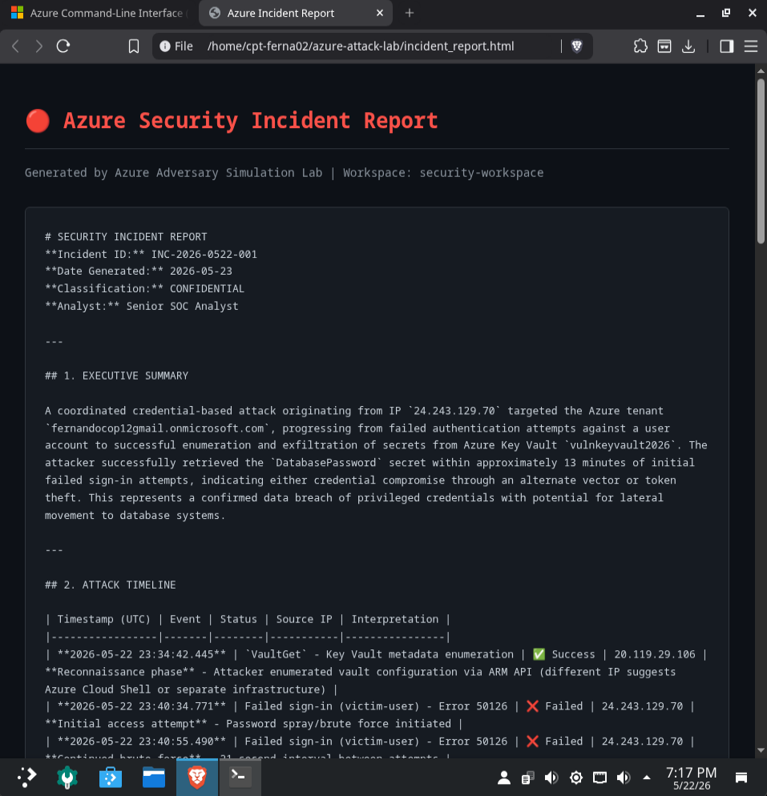

# Azure Adversary Simulation & Detection Pipeline

> Full attack lifecycle simulation on Azure — red team and blue team — with AI-powered detection and incident reporting.


---

## Incident Summary

**Incident ID:** INC-2026-0522-001  
**Classification:** CONFIDENTIAL  
**Severity:** Critical  
**Status:** Simulated — Contained  

A coordinated credential-based attack...

📄 **[View Full Incident Report (PDF)](Azure%20Incident%20Report.pdf)**

---

## Attack Architecture

```
[Attacker]
    │
    ├── 1. Password Spray → Entra ID (victim-user)
    │
    ├── 2. Device Code Phishing → OAuth Token Theft
    │
    ├── 3. Service Principal Abuse → Subscription Enumeration
    │
    ├── 4. Data Exfiltration
    │       ├── Public Blob Storage (employee PII)
    │       └── Key Vault Secret Dump (DatabasePassword)
    │
    └── 5. Persistence → Automation Runbook Backdoor
```

---

## MITRE ATT&CK TTPs

| Technique ID | Name | Phase |
|---|---|---|
| T1110.003 | Password Spraying | Initial Access |
| T1528 | Steal Application Access Token | Credential Access |
| T1087.004 | Cloud Account Enumeration | Discovery |
| T1530 | Data from Cloud Storage | Exfiltration |
| T1552.001 | Credentials in Files (Key Vault) | Credential Access |
| T1078.004 | Valid Cloud Accounts | Persistence |
| T1098 | Account Manipulation (Runbook) | Persistence |

---

## Vulnerable Infrastructure Built

| Resource | Type | Misconfiguration |
|---|---|---|
| vulnstorage2026 | Storage Account | Public blob access enabled |
| vulnkeyvault2026 | Key Vault | Regular user has secret read access |
| vuln-automation | Automation Account | Runbook persistence mechanism |
| svc-account | User | Contributor at subscription scope |
| victim-user | User | Weak password, no MFA |

---

## Detection Results

### What Sentinel Caught
- ✅ Failed sign-in attempts (Error 50126) — password spray detected
- ✅ Successful authentication after spray
- ✅ Key Vault SecretList and SecretGet operations
- ✅ Authentication failures before secret access

### Detection Gaps Found
- ❌ Device code phishing flow not alerted on by default
- ❌ Public blob access not flagged without Defender for Storage
- ❌ Automation Runbook creation not correlated to attack chain

---

## Stack

| Layer | Tool |
|---|---|
| Cloud Platform | Microsoft Azure (free tier) |
| Identity | Microsoft Entra ID |
| SIEM | Microsoft Sentinel |
| Log Analytics | KQL queries |
| Attack Tools | Python, MSAL, Azure CLI |
| AI Enrichment | Claude API (claude-opus-4-5) |
| OS | Arch Linux + BlackArch |

---

## Key Files

| File | Description |
|---|---|
| `password_spray.py` | Password spray against Entra ID |
| `device_code.py` | OAuth token theft via device code flow |
| `sp_abuse.py` | Service Principal enumeration |
| `exfiltrate.py` | Storage and Key Vault exfiltration |
| `persistence.py` | Automation Runbook backdoor |
| `azure_threat_pipeline.py` | Claude AI enrichment pipeline |
| `incident_report.html` | AI-generated incident report |
| `incident_report.pdf` | PDF version of incident report |

---

## Screenshots

**Password Spray Attack**


**Device Code Token Captured**


**Service Principal Enumeration**


**Data Exfiltration**


**Persistence via Runbook**


**Sentinel Sign-in Detection**


**Sentinel Key Vault Detection**


**Sentinel Data Connectors**


**Azure Resource Group**


**AI Incident Report**


---

## Challenges & Problem Solving

### 1. Azure CLI Authentication Loop
**Problem:** After logging in with `az login`, the CLI kept returning `No subscriptions found` even though the portal showed an active subscription. The free trial account required MFA but the CLI was authenticating against the wrong tenant.

**Solution:** Explicitly specified the tenant ID during login:
```bash
az login --tenant ea287e17-fbcb-4905-948e-f8d6c7f1cb59
```
This forced the CLI to authenticate against the correct directory and MFA completed successfully.

---

### 2. Resource Provider Registration
**Problem:** Creating the Storage Account and Key Vault both failed with `MissingSubscriptionRegistration` errors. On a brand new free tier Azure account, resource providers are not registered by default.

**Solution:** Manually registered each provider and waited for confirmation:
```bash
az provider register --namespace Microsoft.Storage
az provider register --namespace Microsoft.KeyVault
az provider show --namespace Microsoft.KeyVault --query "registrationState"
```
Had to wait 1-2 minutes per provider until status returned `"Registered"`.

---

### 3. Storage Blob Upload Permissions
**Problem:** Uploading the fake sensitive file to the blob container failed with a permissions error even though we created the storage account. Azure RBAC requires explicit data-plane role assignments separate from control-plane ownership.

**Solution:** Assigned the `Storage Blob Data Owner` role using our object ID (email address lookup fails on free tier):
```bash
az ad signed-in-user show --query id -o tsv
az role assignment create --assignee <object-id> --role "Storage Blob Data Owner" ...
```

---

### 4. Zsh Quote Handling
**Problem:** Multi-line commands with double quotes caused zsh to enter `dquote>` mode waiting for a closing quote, breaking every command that had string arguments.

**Solution:** Switched all string arguments to single quotes and moved long commands into bash scripts:
```bash
nano command.sh  # write command inside file
bash command.sh  # execute with bash instead of zsh
```

---

### 5. Sentinel Data Connectors Showing 0 Results
**Problem:** Searching for Microsoft Entra ID in Sentinel's Data Connectors panel returned nothing. The connector existed but wasn't installed yet.

**Solution:** Navigated to Content Hub inside Sentinel, installed the Microsoft Entra ID and Azure Activity solution packages first, then returned to Data Connectors where they appeared and could be configured.

---

### 6. SigninLogs Empty After Attack
**Problem:** Running KQL queries immediately after the password spray returned no results in `SigninLogs`.

**Solution:** Azure Log Analytics has a 5-20 minute ingestion delay. Waited for data to propagate, then verified which tables had data using:
```kql
search *
| where TimeGenerated > ago(2h)
| summarize count() by Type
| order by count_ desc
```
This confirmed logs were flowing before writing specific detection queries.

---

### 7. Anthropic API Authentication Failure
**Problem:** The Claude enrichment pipeline crashed with `Could not resolve authentication method` when calling the Anthropic API.

**Solution:** The API key was not set in the environment. Exported it before running the pipeline:
```bash
export ANTHROPIC_API_KEY="your-key-here"
```

---

### 8. KQL Column Name Mismatch
**Problem:** The Key Vault detection query failed with `Failed to resolve scalar expression named 'identity_claim_upn_s'` because Azure Diagnostics column names vary by tenant configuration.

**Solution:** Removed the unknown column and used only verified columns present in our schema:
```kql
AzureDiagnostics
| where ResourceType == "VAULTS"
| project TimeGenerated, OperationName, ResultSignature, requestUri_s, CallerIPAddress
```
Learned that AzureDiagnostics schema is dynamic — always verify column names exist before projecting them.

---

## How to Reproduce

1. Create a free Azure account at portal.azure.com
2. Clone this repo
3. Install dependencies:
```bash
python -m venv azure-lab
source azure-lab/bin/activate
pip install azure-identity azure-mgmt-resource azure-mgmt-authorization azure-monitor-query anthropic requests msal
```
4. Login to Azure CLI:
```bash
az login --tenant <your-tenant-id>
```
5. Set your Anthropic API key:
```bash
export ANTHROPIC_API_KEY="your-key-here"
```
6. Run scripts in order:
```bash
python password_spray.py
python device_code.py
python sp_abuse.py
python exfiltrate.py
python persistence.py
python azure_threat_pipeline.py
```
7. Open `incident_report.html` in your browser to view the AI-generated report

---

## Author

**Fernando Cortez** — [@cpt-ferna02](https://github.com/cpt-ferna02)
